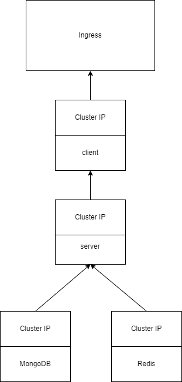

# Diagram

# Ingress

Wystawia aplikację na localhosta, port 80.

# Client-Cluster-IP-Service

Umożliwia połączenie pomiędzy clientem, a resztą klastra.

# Client

Tworzy obraz pobrany z Docker Hub odpowiedzialny za frontend.

# Server-Cluster-IP-Service

Umożliwia połączenie pomiędzy serverem, a resztą klastra.

# Server

Tworzy obraz pobrany z Docker Hub odpowiedzialny za backend.
Tylko tutaj repliki zostały ustawione na 2

# MongoDB-Cluster-IP-Service

Umożliwia połączenie pomiędzy bazą MongoDB, a resztą klastra.

# MongoDB

Tworzy obraz pobrany z Docker Hub odpowiedzialny za mongoDB.

# Redis-Cluster-IP-Service

Umożliwia połączenie pomiędzy bazą Redis, a resztą klastra.

# Redis

Tworzy obraz pobrany z Docker Hub odpowiedzialny za redis.

# Persistant-Volume

Tworzy połączenie (mapuje) folder na dysku lokalnym ./tmp z bazą mongoDB. Dzięki temu dane zostają zachowane, nawet po 'hard resecie'
